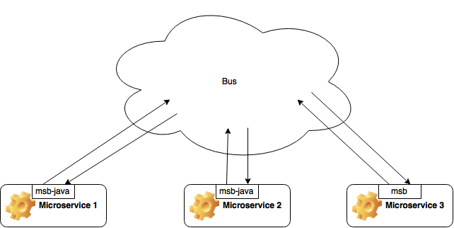
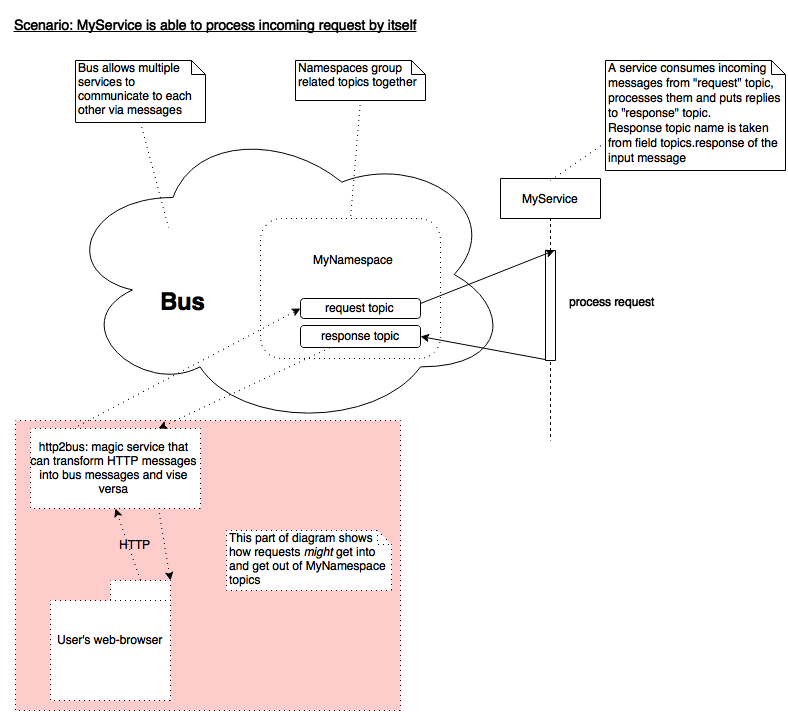
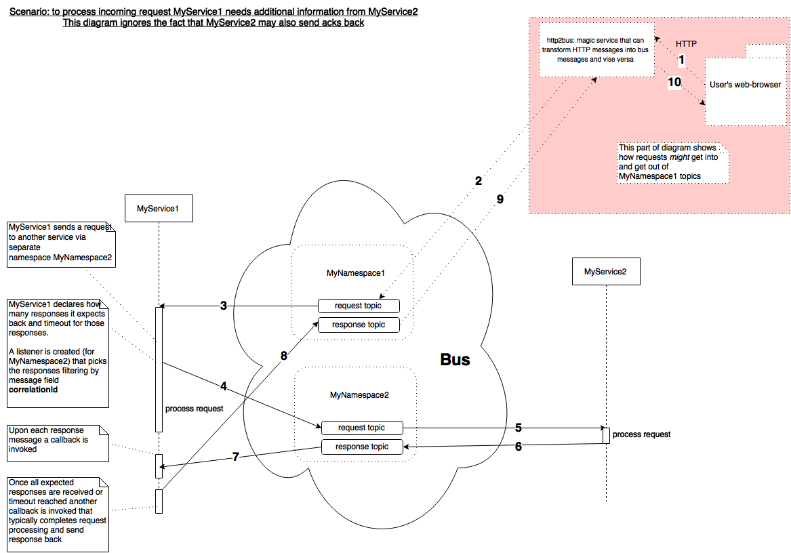
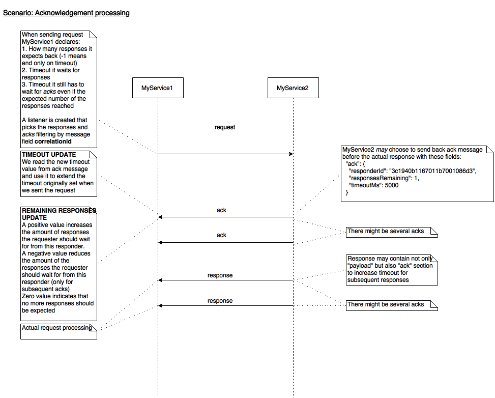
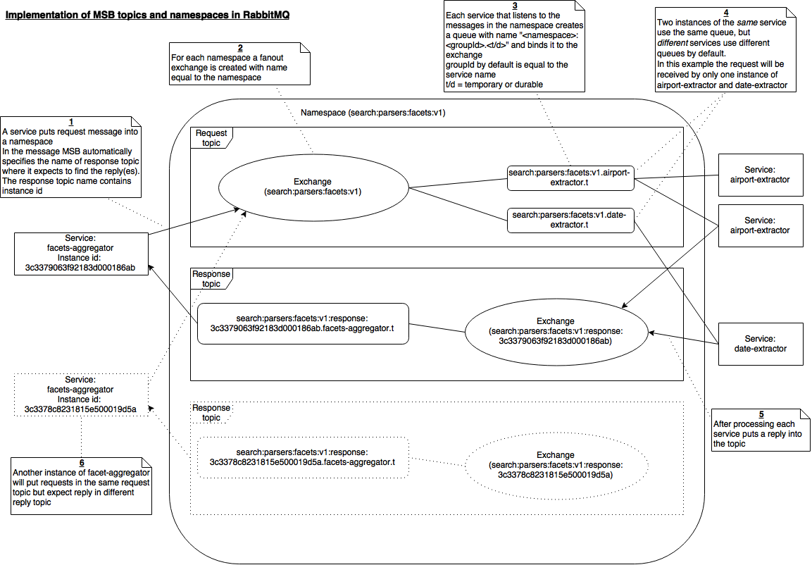
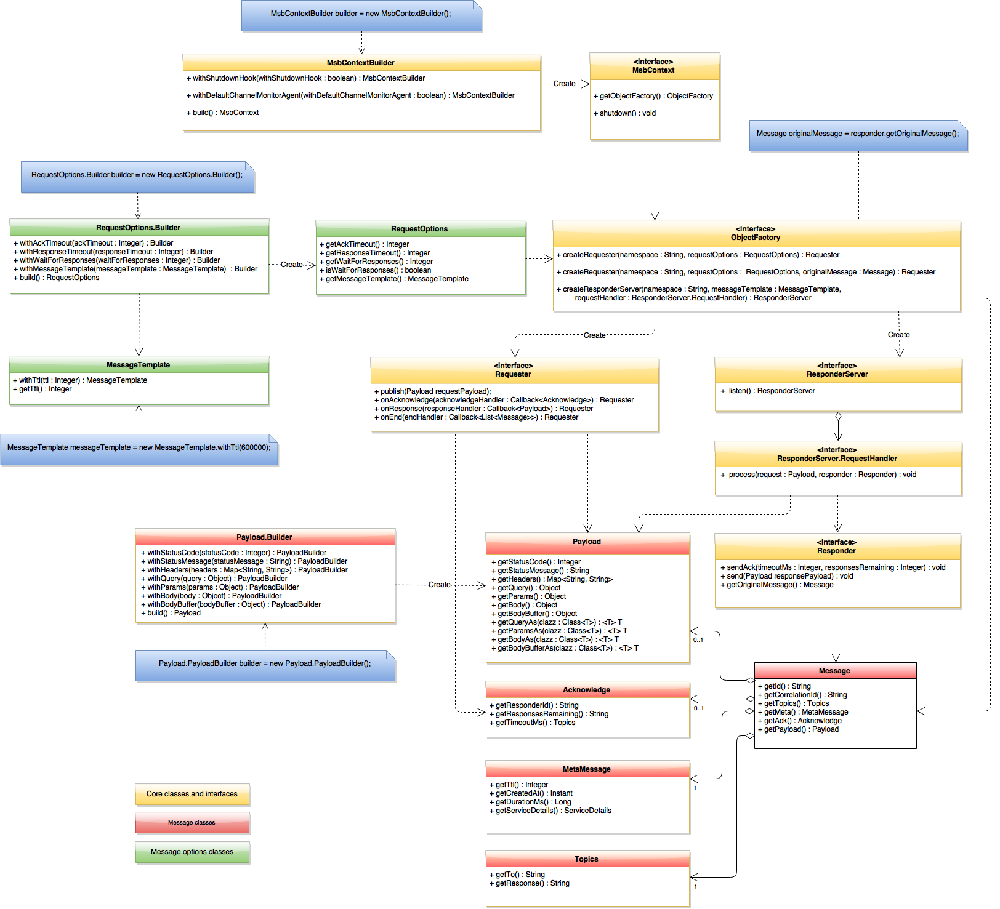

# Overview

[Microservices](https://en.wikipedia.org/wiki/Microservices) is a recent software development approach that allows to build scalable, distributable and fault-tolerant applications. Each microservice is a small independent program (OS process) that does only one thing but does it well. Obviously those microservices should communicate to each other in some way.

The diagram below shows one possible approach when microservices communicate through a common bus:



[MSB-Java](https://github.com/tcdl/msb-java) (for Java) and [MSB](https://github.com/tcdl/msb) (for Node.js) are libraries that can be used by microservice developers to streamline development in the following ways:
* Hide interaction with the bus behind simple interfaces. They support different pluggable adapters for different bus implementations.
* Hide message creation/parsing.
* Natively support some enterprise integration patterns like [Request-Reply](http://www.enterpriseintegrationpatterns.com/RequestReply.html),  [Correlation Identifier](http://www.enterpriseintegrationpatterns.com/CorrelationIdentifier.html), [Publish-Subscribe Channel](http://www.enterpriseintegrationpatterns.com/PublishSubscribeChannel.html) and others.
* MSB and MSB-Java are compatible at protocol level. So Java microservices are able to interact with Node.js microservices.

MSB = MicroService Bus.

MSb-Java version number MAJOR.MINOR.PATCH, is incremented when:

MAJOR version - MSB compatible protocol was changed 
MINOR version - incompatible API changes was made,
PATCH version - added functionality in a backwards-compatible manner, or backwards-compatible bug fixes was made.

# Supported microservice models

Below we consider different ways in which microservices can interact with each other using MSB-Java.

## Listening microservice



The diagram shows a simple microservice (`MyService`) that:
* is subscribed to `request topic`
* processes the incoming request and calculates result
* produces the result in `response topic`.

## Producing microservice

### General flow (no acks)



This diagram shows situation when `MyService1` needs additional information from `MyService2` to process the incoming request. The image contains a lot of arrows so they are numbered to ease understanding of their sequence.

### Adding acks to the mix



By using ack messages `MyService2` can declare to `MyService1` how many responses it's going to produce and how much time it's going to take.

## Message format

Messages are UTF-8 JSON strings. Incoming messages may be validated (depending on configuration settings) against [JSON schema](/core/src/main/resources/schema.js).

Here's an example of a message:

```json
{
  "id": "3c19407acf321800000279b5",
  "correlationId": "3c19407acf3218000003598f",
  "topics": {
    "to": "test:aggregator",
    "response": "test:aggregator:response:3c19407acf32180000016402"
  },
  "meta": {
    "ttl": null,
    "createdAt": "2015-04-17T16:24:26.737Z",
    "durationMs": 0,
    "serviceDetails": {
      "hostname": "Pieter-s-MacBook-Pro.local",
      "ip": "10.166.139.50",
      "pid": 6144,
      "name": "msb",
      "version": "0.3.4",
      "instanceId": "3c19407acf32180000016402"
    }
  },
  "ack": {
    "responderId": "3c824cd39fe87366001ed82e",
    "responsesRemaining": -1,
    "timeoutMs": 500
  },
  "payload": {
    "url": "http://mock",
    "method": "GET",
    "params": {},
    "query": {},
    "headers": {},
    "body": {}
  }
}
```

Here's the field description:

Message field           | Description
------------------------|------------
id                      | unique id of a message
correlationId           | unique id of message sequence related to single conversation. Responses and acks have the same `correlationId` as the request. Also if a microservice receives a request with `correlationId` = "abc" and as a part of processing it sends another request to another microservice it re-uses the same correlationId (for easy tracing of message flow though a system)
topics                  | section for routing information
  to                    | name of the topic this message is sent to
  response              | name of the topic where response to this message is expected
meta                    | section for message meta information
  ttl                   | time to live of a message. If ttl is exceeded an incoming message is ignored
  createdAt             | timezone-aware date/time when message was created
  publishedAt           | timezone-aware date/time when message was published
  durationMs            | time taken to process the message
  serviceDetails        | section for microservice details
    name                | microservice name
    version             | microservice version
    instanceId          | unique id of the running instance of a microservice
    hostname            | name of the host the microservice is runnig on
    ip                  | IP address of a host a microservice is running on
    pid                 | process id of a running microservice
ack                     | section that describes acknowledgement part of the message
  responderId           | unique id of a _responder_. _Resonder_ is a component that is created for _each_ request and is used to send responses and acks back
  responsesRemaining    | adjusts the number of responses expected from this _responder_
  timeoutMs             | defines amount of time this _responder_ needs to completely process the message and send all responses back
payload                 | section for message payload. It may be anything (even plain string) but it is a good idea to make it REST-like for extensibility. Below you can find descripton of fields for REST-like payloads
  headers               | provides things like authorisation, information about the body and information about the user. (Request Meta Info/Who)
  params                | provides hierarchical ids of the entities acted upon. (What)
  query                 | provides instructions. (How)
  statusCode            | response status code
  statusMessage         | response status message
  body                  | provides data/state
  bodyBuffer            | base64-encoded binary body

# MSB-Java API

## Maven modules

MSB-Java has pluggable architecture that allows to use different bus adapters transparently.
It consists of the following Maven modules:
- msb-java-core: core classes
- msb-java-amqp: AMQP adapter that allow to use AMQP broker (for example RabbitMQ) as a bus
- msb-java-cli: CLI monitoring tool
- msb-java-examples: examples of various microservices

## Core classes

All classes and interfaces that should be used by a microservice developer reside in package  [io.github.tcdl.msb.api](/core/src/main/java/io/github/tcdl/msb/api) and its subpackages. [This Appendix](#api-class-diagram) shows relation between all those classes.

The following subsections describe the most important ones.

### [MsbContext](/core/src/main/java/io/github/tcdl/msb/api/MsbContext.java)

Instance of [MsbContext](/core/src/main/java/io/github/tcdl/msb/api/MsbContext.java) is a central object that should be used by microservice for proper initialization, accessing of the bus and shutting down.

* To initialize `MsbContext` one needs to use [MsbContextBuilder](/core/src/main/java/io/github/tcdl/msb/api/MsbContextBuilder.java). During this step configuration files are read and some internal library objects are created and initialized.
* Instance of [ObjectFactory](/core/src/main/java/io/github/tcdl/msb/api/ObjectFactory.java) is stored in `MsbContext`. The factory produces objects that need to be used by microservice to access the bus. A microservice should not create those objects directly.
* To shut down `MsbContext` one needs to use method `MsbContext.shudown`. This step is opposite to initialization: all initialized resources as well as connection to the bus are closed.

> If microservice developer does not want to invoke `shutdown` explictily he/she should instruct `MsbContextBuilder` to automatically register JVM shutdown upon `MsbContext` creation. That hook just invokes the method on JVM termination.

### [ResponderServer](/core/src/main/java/io/github/tcdl/msb/api/ResponderServer.java)

[ResponderServer](/core/src/main/java/io/github/tcdl/msb/api/ResponderServer.java) allows to listen to a given namespace, process requests from that namespace and provide responses and acks back. The instance should be created via `ObjectFactory`.

### [Requester](/core/src/main/java/io/github/tcdl/msb/api/Requester.java)

[Requester](/core/src/main/java/io/github/tcdl/msb/api/Requester.java) allows to send messages to a given namespace and optionally handle responses. The instance should be created via `ObjectFactory`.

## Typical microservice examples

Let's consider two simple microservices: one sends "PING" to another and the other responds "PONG".

[PingService](/examples/src/main/java/io/github/tcdl/msb/examples/PingService.java)

```java
package io.github.tcdl.msb.examples;

import io.github.tcdl.msb.api.MessageTemplate;
import io.github.tcdl.msb.api.MsbContext;
import io.github.tcdl.msb.api.MsbContextBuilder;
import io.github.tcdl.msb.api.ObjectFactory;
import io.github.tcdl.msb.api.RequestOptions;
import io.github.tcdl.msb.api.Requester;
import org.slf4j.Logger;
import org.slf4j.LoggerFactory;

import java.util.UUID;

public class PingService {
    private static final Logger LOG = LoggerFactory.getLogger(PingService.class);

    public static void main(String[] args) {
        MsbContext msbContext = new MsbContextBuilder().
                enableShutdownHook(true).
                build();

        MessageTemplate messageTemplate = new MessageTemplate().withTags("ping-service");
        RequestOptions requestOptions = new RequestOptions.Builder()
                .withAckTimeout(1000)
                .withResponseTimeout(2000)
                .withWaitForResponses(1)
                .withMessageTemplate(messageTemplate)
                .build();

        ObjectFactory objectFactory = msbContext.getObjectFactory();
        Requester<String> requester = objectFactory.createRequester("pingpong:namespace", requestOptions, String.class)
                .onResponse(payload -> LOG.info(String.format("Received response '%s'", payload))) // Handling the one response
                .onEnd(arg -> LOG.info("Received all expected responses")); // Handling all response arrival or timeout

        requester.publish("PING", UUID.randomUUID().toString()); // Send the message
    }
}
```

[PongService](/examples/src/main/java/io/github/tcdl/msb/examples/PongService.java)

```java
package io.github.tcdl.msb.examples;

import io.github.tcdl.msb.api.MessageTemplate;
import io.github.tcdl.msb.api.MsbContext;
import io.github.tcdl.msb.api.MsbContextBuilder;
import io.github.tcdl.msb.api.ObjectFactory;
import io.github.tcdl.msb.api.ResponderServer;
import org.slf4j.Logger;
import org.slf4j.LoggerFactory;

public class PongService {
    private static final Logger LOG = LoggerFactory.getLogger(PongService.class);

    public static void main(String[] args) {
        MsbContext msbContext = new MsbContextBuilder().
                enableShutdownHook(true). // Instruct the builder to auto-register hook that does graceful shutdown
                build();

        ObjectFactory objectFactory = msbContext.getObjectFactory();
        MessageTemplate messageTemplate = new MessageTemplate().withTags("pong-static-tag");
        ResponderServer responderServer = objectFactory.createResponderServer("pingpong:namespace", messageTemplate, (request, responder) -> {
            // Response handling logic
            LOG.info(String.format("Handling %s...", request));

            responder.send("PONG");

            LOG.info("Response sent");
        }, String.class);
        responderServer.listen(); // Need not forget to hook up the responder server
    }
}
```

To launch those you need to have RabbitMQ up and running. Also you have to start `PongService` before `PingService`.

Another caveat is that the business logic of `PongService` (passed as lambda in the last argument during `ResponderServer` creation) can be invoked from different threads concurrently. So the lambda should be __thread-safe__. The same applies to the lambda passed as an argument to `onResponse` in `PingService`.

## CLI tool

See [Readme for CLI tool](/cli/README.md).

# Appendix

## Configuration
We use [Typesafe Config library](https://github.com/typesafehub/config/blob/master/README.md) ver.1.2.1 for configuration access.

### Following configuration files are used:
_amqp.conf_ – default settings specific for _AMQP broker_.
If another broker is used e.g. _Redis broker_, then settings particular for this broker need to be specified. The following environmental variables may be used to override the default variables `MSB_BROKER_HOST, MSB_BROKER_PORT`.

See [amqp.conf example](/amqp/src/main/resources/amqp.conf)

_reference.conf_ – a source of configurations parameters for MSB-Java.
This file contains default configuration values.
The idea is that libraries and frameworks should ship with a reference.conf in their jar.
The configuration file is written in _JSON_ superset called _"Human-Optimized Config Object Notation"_ or [HOCON](https://github.com/typesafehub/config/blob/master/HOCON.md) and files use the suffix _.conf_.
Overrides values from _amqp.conf_.

The following environmental variables may be used to override the default variables `MSB_SERVICE_NAME, MSB_SERVICE_VERSION, MSB_SERVICE_INSTANCE_ID`.

See [reference.conf example](/core/src/main/resources/reference.conf)

_application.conf_ – applications should provide an application.conf with any settings specific for this particular application.
Overrides values from _reference.conf_.

See [application.conf example](/cli/src/main/resources/application.conf)

All configuration files use _key-value pair_ structure.

### Configuration files hierarchy
- [amqp.conf](/amqp/src/main/resources/amqp.conf)
- [reference.conf](/core/src/main/resources/reference.conf) - overrides values from amqp.conf
- [application.conf](/cli/src/main/resources/application.conf) - overrides values from reference.conf

### Description of MSB configuration fields
Service details section describes microservice parameters.

- `name ` – microservice name. All running instances of the same microservice must have the same name.
- `version` – microservice version. At the moment MSB-Java doesn't handle the value.
- `instanceId` – unique microservice instance id. All running instances of the same microservice must have different instanceId.

Additional instances of a microservice can help with load balancing. The simplest way to have multiple instances is to deploy, configure and run a microservice from different locations with different instanceId values. In this case a value of a instanceId need to be specified directly (or by means of environment variables, see below) in the application.conf, for example:

`instanceId = "msb-d06a-ed59-4a39-9f95-811c5fb6ab87"`

But if a microservice should be deployed and configured only once (for example, due to automatic load balancing reasons), particular instanceId need to be absent in the config. The MSB-Java automatically generates unique instanceId for each microservice run if the value is not present in the config. The instanceId is stable during a run but after microservice restart it could be different.

The MSB-Java uses instanceId for generation of a response topic name. So if *namespace* is a name of the topic where message is sent to, then name of the topic where response is expected should be: *namespace*:response:*instanceId*.

You may set Service details values directly

`name = "msb_java"`

or specify the value with the help of environment variables, using the `${?foo}` substitution syntax.

`name = ${?MSB_SERVICE_NAME}`

Here, the override field `name = ${?MSB_SERVICE_NAME}` simply vanishes if there's no value for `MSB_SERVICE_NAME`, but if you set an environment variable `MSB_SERVICE_NAME`, it would be used. A natural extension of this idea is to support several different environment variable names or system property names, if you aren't sure which one will exist in the target environment.

`timerThreadPoolSize` – number of threads used for scheduling ack and response timeout tasks. Specifies the max possible number of threads. Defaults to 2.

`validateMessage` – [JSON schema](/core/src/main/resources/schema.js) message validation toggle, true/false. Defaults to true.

`brokerAdapterFactory` – message broker class. Defaults to `"io.github.tcdl.adapters.amqp.AmqpAdapterFactory"`.

### Description of AMQP connection configuration fields
The _key values pairs_ described in this section are specific for the chosen Broker.
The section `brokerConfig` from [reference.conf](/core/src/main/resources/reference.conf) file override values from [amqp.conf](/amqp/src/main/resources/amqp.conf).

`charsetName` – specifies charset for encoding and decoding of messages. Defaults to "UTF-8"  as
 this encoding is used in MSB (Node.js).

`host` – IP address of message broker, defaults to "127.0.0.1"

`port` – port number

`useSSL` – defines whether we need to use SSL for AMQP connection. For the moment only simplest form of security is implemented that provides encryption but does not check remote certificates.

`groupId` – microservices with the same `groupId` subscribed to the same namespace will receive messages from that namespace in round-robin fashion. If microservices have different `groupId`s and subscribed to the same namespace then all of those microservices are going to receive a copy of a message from that namespace.

`durable` – queue durability, true/false. Defaults to false.
Specifies one of the two types of the queue:
`durable` = `true` – durable queue, that survives broker restart
`durable` = `false` – transient queue, is auto removed once the listening service is stopped.

See for more [detail](https://www.rabbitmq.com/tutorials/amqp-concepts.html).

`consumerThreadPoolSize` – number of consumer threads used to process incoming messages. Defines the level of parallelism. Default is 5.

`consumerThreadPoolQueueCapacity` – maximum number of requests waiting in FIFO queue to be processed by consumer thread pool. Should be positive integer or -1. Value of -1 stands for unlimited.

The following fields are optional in case of broker running on local machine
but are mandatory when using broker on remote computer. When there is a need to override the default values these fields are specified in application.conf file as additional `brokerConfig` parameters.

`username` – login of the user connecting to remote machine, defaults to “guest”

`password` – string of characters for user authentication, defaults to “guest”

As was mentioned above the default values may be used only for the connection via local host.
More references on how to configure the broker to allow the remote access with the default values “guest” can be found [here](https://www.rabbitmq.com/access-control.html).

`virtualHost` – virutal host in RabbitMQ is more like a logical container where a user connected to a particular virtual host cannot access any resource (exchange, queue...) from another virtual host.

`heartbeatIntervalSec` - interval of the heartbeats that are used to detect broken connections. Zero for none. See for more details: https://www.rabbitmq.com/heartbeats.html. Defaults to 1 second.

`prefetchCount` - Specify the limit number of unacknowledged messages on a channel when consuming. The default value is 10.


## AMQP adapter

AMQP adapter is a module that allows to use any AMQP broker as a bus (for example RabbitMQ). [This article](https://www.rabbitmq.com/tutorials/amqp-concepts.html) gives a good overview of AMQP concepts.

Basically it allows to send and receive messages to _namespaces_ which consists of _topics_ through AMQP broker. Namespaces and topics are logical concepts used by MSB-Java. The diagram below describes how they are mapped to AMQP native entities like exchanges and queues. The comments on the diagram are numbered to ease comprehension:



An interest twist is related to consumption of incoming messages. The adapter gets a message as soon as it arrives from broker and immediately puts it in _processing executor service_ from which those messages are picked up by worker threads. Parameters for that executor service like queue size and number of workers may be tweaked via configuration.

The adapter supports AMQP connection recovery out of the box and it's always enabled. It's regulated by `heartbeatIntervalSec` and  `networkRecoveryIntervalMs` configuration values (see [this section](#description-of-amqp-connection-configuration-fields) for more details).

The AMQP adapter supports explicit and automation message confirm/reject/retry acknowledgment. If a message was successfully processed, a microservice should enable confirms. In exceptional cases when the microservice is unable to handle messages successfully, reject or retry acknowledgment need be to send. If microservice doesn't explicitly send acknowledgment, MSB-Java can do it automatically after completion of message processing in current thread. If microservice provides more complexity message processing, for example in additional threads, AutoAcknowledgement need to be set to false. In this case a microservice is responsible for acknowledgment.

## Channel monitoring

Built-in channel monitoring allows to monitor micorservices/channels on the bus level. It consists of 2 components:

- **Agent** which resides in each microservice we'd like to monitor
- **Aggregator** which is a part of special _infrastructure_ microservice(s) that are able to process the information sent by agents

The following diagrams illustrates monitoring:


1. Agent runs as part of a microservice (`DateExtractor` in this example). It's activated/deactivated via `MsbContextBuilder`. It collects statistics about all topics that the microservice uses to send or receive messages as well as _when_ the last message was consumed or produced in each of them by the microservice.
2. When the microservice starts using a new topic the agent sends a broadcast message to service topic `_channels:announce`.
3. Aggregator runs as a part of another microservice (`Monitor` in this example). It's subscribed to the announcement topic and collect information from _all_ microservices that have agents activated.
4. In addition to that aggregator sends periodic heartbeat requests into a service topic `_channels:heartbeat`.
5. The agent is subscribed to the heartbeat topic and whenever a heartbeat message arrives it sends back fresh stats (into the response topic). That fresh stats can be used to actualize aggregator's statistics.
6. The aggregator statistics may be used to build graph of "alive" microservices. Another example would be logger that subscribes to every known channel and achives all the messages going though them.

Here's an example of payload of heartbeat/announcement message:

```json
"payload": {
  "body": {
    "search:parsers:facets:v1": {
      "producers": false,
      "consumers": true,
      "lastConsumedAt": "2015-07-08T07:10:55.219Z"
    },
    "search:parsers:facets:v1:response:3c839d933c591bc80001379d": {
      "producers": true,
      "consumers": false,
      "lastProducedAt": "2015-07-08T07:10:55.290Z"
    }
  }
}
```

## API class diagram

The following diagram describes a set of classes and interfaces involved in calls from a microservice to MSB-Java and callbacks.


